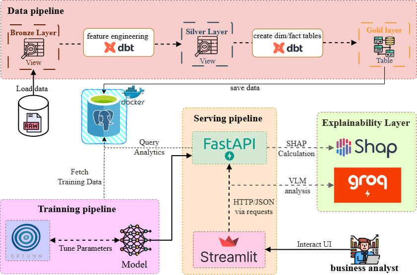

# Sales Forecasting Integration Framework

## Executive Summary

This repository defines an integrated sales forecasting system resolving the Walmart Recruiting II Sales in Stormy Weather analytical challenge. The defining problem requires predictive algorithms to quantify how severe meteorological phenomena influence the purchasing velocity of weather-sensitive retail inventory across diverse geographic locations. The foundational training data originates directly from the official Kaggle competition registry [//www.kaggle.com/competitions/walmart-recruiting-sales-in-stormy-weather/overview].

The technical implementation unifies a centralized data warehouse methodology with a structured Machine Learning Operations pipeline. The infrastructure relies on PostgreSQL as the foundational Relational Database Management System. Data Build Tool executes structured query logic to map raw inputs into analytical dimensional models. The machine learning sequence incorporates MLflow for framework registration tracking alongside Optuna for mathematical hyperparameter optimization. A FastAPI application serves inference payloads. A Streamlit graphical interface visualizes Explainable Artificial Intelligence interpretations.

## Architectural Hierarchy



The physical distribution of files reflects stringent structural separation defining specific operational scopes.

```text
sales_forecasting_xai/
├── backend/                # Application Programming Interface network endpoints
├── data_platform/          # Database runtime and analytical query formulation
│   ├── dbt/                # Data Build Tool dimensional transformations
│   └── infra/              # Virtual container orchestration definitions
├── frontend/               # Graphical interface application elements
├── ml/                     # Machine learning algorithms and tuning matrices
└── shared/                 # Centralized parameter targets and temporary local storage
```

The operational domains enforce strict capability boundaries.

| Directory Module | Evaluated Capability |
|---|---|
| data_platform | Database infrastructure provisioning alongside analytical logic aggregation |
| ml | Predictive algorithm mathematical training and modeling configurations |
| shared | Global variable assignments enforcing parameter inheritance |
| backend | Endpoint mapping logic distributing trained model inferences |
| frontend | Graphical translation protocols analyzing interpretation patterns |

## Deployment Strategy

### Required Dependencies

The implementation requires specific host libraries.

* A container runtime environment
* Python version 3.10 and above
* The uv package manager
* Free network ports spanning 5432 for database access and 5000 for metric tracking
* Free network ports spanning 8000 for backend routing and 8501 for frontend display

### Execution Sequence

The deployment must follow a strictly defined initialization matrix.

Step 1. Instantiate the PostgreSQL persistent storage.
```bash
cd data_platform/infra/postgres
docker compose up -d
```

Step 2. Launch the MLflow tracking service.
```bash
mlflow server --host 127.0.0.1 --port 5000
```

Step 3. Execute the data extraction and training routines.
```bash
cd ml
uv run python scripts/prepare_data.py
uv run python scripts/tune.py
uv run python scripts/train.py --best-params outputs/best_params.json
```

Step 4. Initialize the FastAPI backend service.
```bash
cd backend
uv run fastapi dev src/api/main.py --port 8000
```

Step 5. Launch the Streamlit visualization interface.
```bash
cd frontend
uv run streamlit run src/app.py
```

## Environment Configuration

The application authenticates using variables located within the root environment configuration file.

| Environment Variable | Operational Boundary |
|---|---|
| POSTGRES_USER | Master username for PostgreSQL authentication |
| POSTGRES_PASSWORD | Security key for PostgreSQL access |
| POSTGRES_DB | Target database namespace |
| POSTGRES_HOST | Database host network address |
| POSTGRES_PORT | Database communication port |
| MLFLOW_TRACKING_URI | Network path mapping the metric logging server |

## Strategic Decisions

The system topology reflects precise engineering decisions.

* PostgreSQL and Data Build Tool. PostgreSQL provides a standard relational engine simplifying data persistence. Data Build Tool guarantees idempotency and testability for SQL transformations.
* MLflow and Optuna. MLflow standardizes the aggregation of evaluation metrics across experiment runs. Optuna applies mathematical optimization techniques to replace exhaustive grid search matrices.
* FastAPI and Streamlit. FastAPI implements asynchronous task execution supporting simultaneous client connections. Streamlit facilitates the mathematical translation of Explainable Artificial Intelligence matrices into visual representation charts.

## Navigation Guide

The repository enforces modular separation of concerns.

1. Application Frontend. Evaluates the interactive components and Explainable Artificial Intelligence frameworks.
2. Application Backend. Outlines the prediction rendering boundaries.
3. Machine Learning Logic. Describes the pipeline constructing the LightGBM models.
4. Database Infrastructure. Contextualizes the containerized PostgreSQL environment.
5. Analytical Models. Delineates the Data Build Tool structured queries.
6. Shared Resources. Identifies centralized parameter constraints and local staging records.
