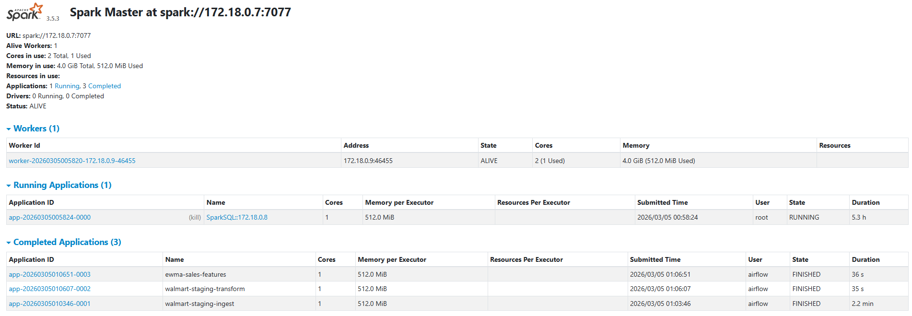
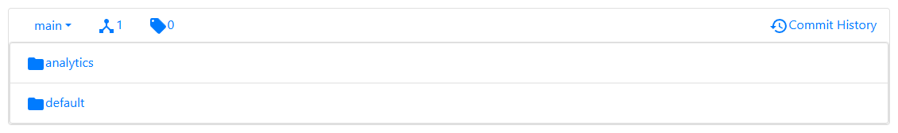

# Data Platform (Lakehouse Architecture)

This project implements a modern data platform using Spark and MinIO for the Data Lake.

## Architecture Overview

```
Raw CSV → MinIO Bronze → Spark Staging → MinIO Silver → Spark Intermediate → MinIO Gold → dbt Iceberg
```

### Components

| Component | Technology | Purpose |
|-----------|-----------|---------|
| **Data Lake** | MinIO | Object storage for Bronze, Silver, and Gold layers |
| **Processing** | Spark | Distributed data transformation engine |
| **Orchestration** | Airflow | Workflow scheduling and dependency management |
| **Metadata** | PostgreSQL | Metadata store for Nessie and Airflow |

## 📂 Project Structure

```text
data_platform/
├── infra/                              # Infrastructure
│   ├── trino/
│   │   └── docker-compose.yml          # Trino for analytical serving
│   ├── postgres/
│   │   └── docker-compose.yml          # Metadata store
│   └── spark_minio/
│       ├── docker-compose.yml
│       ├── Dockerfile
│       └── scripts/
│           ├── load_raw_data.py        # Raw CSV → Bronze
│           └── load_holidays.py        # Holidays → Bronze
│
├── datalake/                           # Data Lake metadata
│   ├── schemas/                        # Schema definitions
│   └── docs/                           # Data dictionary
│
├── spark/                              # Spark ETL jobs
│   ├── src/                            # Reusable libraries
│   ├── jobs/
│   │   ├── staging/                    # Bronze → Silver
│   │   └── intermediate/               # Silver → Gold
│   └── configs/                        # Environment configs
│
├── pipelines/                          # Orchestration
│   └── airflow/
│       └── dags/
│
│   └── sales_forecasting_lakehouse/    # Lakehouse models using Spark
│       ├── models/
│       │   ├── marts/                  # Analytics ready Iceberg tables
│       │   └── staging/                # Initial cleaning models
│       ├── seeds/
│       ├── tests/
│       └── macros/
│
├── .python-version
├── pyproject.toml
├── README.md
└── uv.lock
```

## 🚀 Quick Start

### 1. Setup Shared Network

The infrastructure components communicate via a shared Docker network named `data_platform_net`. You must create this network once before starting the stack:

```powershell
docker network create data_platform_net
```

### 2. Start Infrastructure

With the shared network created, you can now start the components in any order.

```powershell
# 1. Start Spark and MinIO
cd infra/spark_minio
docker-compose up -d

# 2. Start PostgreSQL (Metadata Store)
cd infra/postgres
docker-compose up -d

# 3. Start Trino (Serving Engine)
cd infra/trino
docker-compose up -d

# 4. Start Airflow (Orchestrator)
cd infra/airflow
docker-compose up -d
```

### 3. Load Raw Data to MinIO

```powershell
# Load raw CSV files to Bronze layer
uv run python infra/spark_minio/scripts/load_raw_data.py

# Load holidays data
uv run python infra/spark_minio/scripts/load_holidays.py
```

### 3. Run Spark Jobs

```powershell
# Staging transformation from Bronze to Silver
spark-submit spark/jobs/staging/sales_staging.py

# Intermediate transformation from Silver to Gold
spark-submit spark/jobs/intermediate/sales_features.py
```

### 4. Run dbt (Manual)

```powershell
cd dbt/sales_forecasting_lakehouse
uv run dbt run
```

## 📊 Data Layers

### Bronze Layer (Raw)
- **Storage**: MinIO `bronze/` bucket
- **Format**: Parquet
- **Content**: Raw data from CSV files, no transformations
- **Source**: `infra/spark_minio/scripts/load_raw_data.py`

### Silver Layer (Staged)
- **Storage**: MinIO `silver/` bucket
- **Format**: Parquet
- **Content**: Cleaned and staged data
- **Transformations**: 
  - Column renaming
  - Type casting
  - Basic data cleaning
  - Missing value handling
- **Source**: `spark/jobs/staging/`

### Gold Layer (Features)
- **Storage**: MinIO `gold/` bucket
- **Format**: Parquet
- **Content**: Feature-engineered data ready for ML/Analytics
- **Transformations**:
  - Lag features
  - Rolling window aggregations
  - EWMA calculations
  - Store/Item context features
  - Date features
  - Weather integration
- **Source**: `spark/jobs/intermediate/`

### Marts Layer Iceberg Tables
- **Storage** MinIO
- **Format** Apache Iceberg
- **Content** Analytical datasets ready for Machine Learning and BI
- **Engine** dbt and Apache Spark
- **Source** `dbt/sales_forecasting_lakehouse/models/marts/`

## Platform Architecture

### Spark Processing Cluster



The Airflow driver node and Spark executor nodes are aligned to use Python 3.12. The Spark configuration explicitly targets the correct Python executable paths for both environments. Because Python 3.12 removes the distutils module, the container build definitions upgrade setuptools and wheel to provide a necessary compatibility layer.

### Airflow Asset Orchestration


The orchestration framework relies on the Airflow SDK Asset class rather than legacy Dataset objects. The triggering asset events lookup relies on iterative URI string matching to prevent dictionary hashing errors when analyzing asset metadata. The workflow applies Asset objects as dictionary keys to correctly distribute metadata across downstream consuming operations.

Astronomer Cosmos parses dbt project definitions directly into Airflow execution groups. This design allows dependency management entirely inside the Data Lakehouse environment.


### Nessie Catalog

The storage strategy implements data repository branching and active version control capabilities using Apache Nessie. 



The architecture routes Airflow task states and Nessie catalog versioning logs into a unified internal PostgreSQL instance.

##  Resources

- [dbt Documentation](https://docs.getdbt.com/)
- [Apache Spark Documentation](https://spark.apache.org/docs/latest/)
- [MinIO Documentation](https://min.io/docs/)
- [Airflow Documentation](https://airflow.apache.org/docs/)
