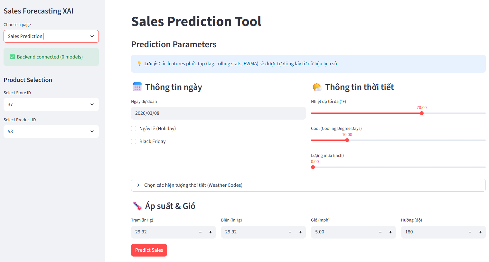

# Frontend Dashboard (Streamlit)

Interactive dashboard for Sales Forecasting visualization and XAI insights.


## Features
- **Sales Forecast**: Visualize predicted sales over time.

  

- **XAI Dashboard**: Explanations for predictions using SHAP plots.
- **LLM Integration**: Natural language summary of model insights.

## Prerequisites

Frontend utilizes the Trino query engine to retrieve analytical datasets from the Data Lakehouse.

Start the Trino infrastructure before running the application.

```bash
cd ../data_platform/infra/trino
docker-compose up -d
```

## Quick Start

### 1. Install Dependencies
```bash
uv sync
```

### 2. Run App
```bash
uv run streamlit run src/app.py
```
The application will open in your default browser at `http://localhost:8501`.

