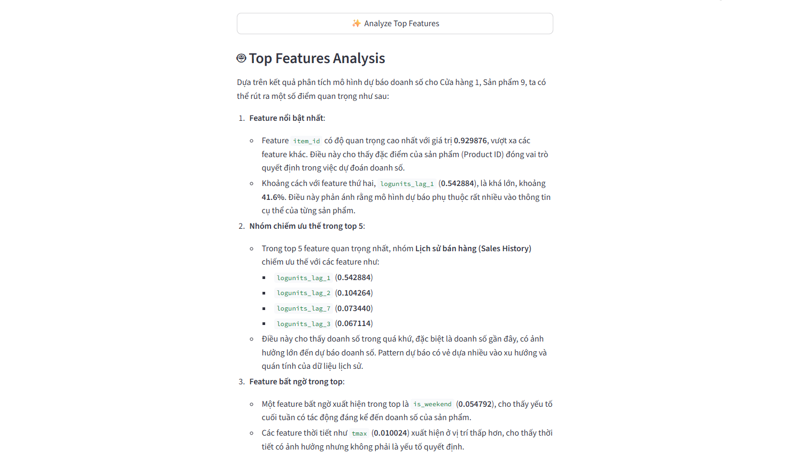

# XAI Module - Explainable AI for Sales Forecasting

## 📁 Module Structure

```
src/ui_xai/
├── __init__.py           # Module exports
├── explainer.py          # SHAP computation & feature classification
├── shap_plots.py         # Visualization functions
└── xai_view.py           # Main Streamlit view
```

## 🚀 Features

### 1. **Global Explanations**
- **Feature Importance**: Bar charts showing which features matter most
- **Category Analysis**: Business-level grouping (Sales History, Store/Item Context, Weather, etc.)
- **SHAP Summary Plot**: Beeswarm visualization showing feature value impacts


### 2. **Dependency Analysis**
- Interactive dependency plots
- Explore non-linear relationships between features and predictions
- Automatic interaction detection

### 3. **Local Explanations**
- Waterfall plots for individual predictions
- Top increasing/decreasing factors
- Prediction vs actual comparison



## 📊 Feature Categories

The module automatically classifies features into 7 business categories:

1. **Sales History** (32.8%) - Lag features, rolling means, EWMA
2. **Item Context** (46.4%) - Product-level aggregations
3. **Store Context** (18.1%) - Store-level performance
4. **Calendar & Events** (2.2%) - Day of week, holidays, seasons
5. **Weather Conditions** (0.4%) - Temperature, precipitation, pressure
6. **Weather Codes** (0.1%) - Weather phenomena (RA, SN, FG, etc.)
7. **Other** - Miscellaneous features

## 🎯 Usage

### In Streamlit App

```python
from src.ui_xai import xai_explanation_view

# In your main app
xai_explanation_view(data, models_dict, feature_engineered_data)
```

### Programmatic Usage

```python
from src.ui_xai import (
    get_model_for_store_item,
    prepare_sample_data,
    compute_shap_values,
    plot_global_feature_importance
)

# Get model
model = get_model_for_store_item(models_dict, store_nbr=37, item_nbr=105)

# Prepare data
X_sample, df_sample = prepare_sample_data(
    feature_engineered_data,
    store_nbr=37,
    item_nbr=105,
    feature_cols=feature_columns
)

# Compute SHAP
shap_values, expected_value = compute_shap_values(model, X_sample.values, feature_cols)

# Plot
import matplotlib.pyplot as plt
fig = plot_global_feature_importance(shap_values, feature_cols, top_n=20)
plt.show()
```

## 🔧 Key Functions

### Explainer Module (`explainer.py`)

| Function | Description |
|----------|-------------|
| `get_model_for_store_item()` | Retrieve model for (store, item) pair|
| `prepare_sample_data()` | Sample and prepare data for SHAP |
| `compute_shap_values()` | Compute SHAP values with caching |
| `classify_feature()` | Classify feature into business category |
| `get_feature_importance_df()` | Create importance DataFrame |
| `get_category_summary()` | Aggregate by category |

### Plotting Module (`shap_plots.py`)

| Function | Description |
|----------|-------------|
| `plot_global_feature_importance()` | Horizontal bar chart |
| `plot_shap_beeswarm()` | SHAP summary plot |
| `plot_feature_importance_by_category()` | Dual-panel category viz |
| `plot_shap_waterfall()` | Local explanation waterfall |
| `plot_shap_dependence()` | Feature-SHAP relationship |
| `create_local_explanation_table()` | Top factors table |

### View Module (`xai_view.py`)

| Function | Description |
|----------|-------------|
| `xai_explanation_view()` | Main Streamlit view |
| `create_store_item_selector()` | Sidebar selector widget |
| `display_global_explanations()` | Global viz section |
| `display_dependence_analysis()` | Dependency plots section |
| `display_local_explanations()` | Local explanations section |

## ⚡ Performance Optimizations

1. **Streamlit Caching**: SHAP values are cached per (store, item) pair
2. **Lazy Loading**: Data only loaded when needed
3. **Sample Size**: Default 500 samples for balance between speed and accuracy
4. **Efficient Plotting**: Matplotlib figures properly managed

## 📝 Code Quality

✅ **Clean Code Principles:**
- Comprehensive docstrings
- Type hints in function signatures
- PEP 8 compliant formatting
- Modular design with clear separation of concerns
- DRY (Don't Repeat Yourself) approach
- Error handling for edge cases

✅ **Best Practices:**
- Reusable functions
- Consistent naming conventions
- Well-organized imports
- Proper resource management

## 🎨 UI/UX Features

- **Tab-based navigation** for different visualization types
- **Interactive widgets** for feature/sample selection
- **Responsive layout** with appropriate column widths
- **Clear explanations** with markdown descriptions
- **Informative metrics** and summaries
- **Color-coded** category visualizations

## 🔍 Example Insights

From SHAP analysis, you can answer questions like:

1. **Which features drive predictions?**
   - e.g., "logunits_max_28d contributes 29% of importance"

2. **How do features interact?**
   - e.g., "High temperature reduces sales for certain items"

3. **Why did the model predict X for date Y?**
   - e.g., "Store performance was low (-3.2 SHAP), but item trend was high (+5.1 SHAP)"

4. **What business factors matter most?**
   - e.g., "Sales History (33%) > Item Context (46%) > Store Context (18%)"

## 📚 Dependencies

```python
numpy
pandas
streamlit
shap
matplotlib
seaborn
```

## 🚦 Status

✅ **Phase 1**: Core Logic - Complete  
✅ **Phase 2**: Visualization Functions - Complete  
✅ **Phase 3**: Main View Integration - Complete  
✅ **Integration**: Added to app.py - Complete  

## 📖 References

- [SHAP Documentation](https://shap.readthedocs.io/)
- [Streamlit Documentation](https://docs.streamlit.io/)
- Project: Sales Forecasting with XAI
- Notebook: `notebooks/wallmart_data/05_explain_model.ipynb`

---

**Last Updated**: 2025-12-05  
**Author**: Sales Forecasting XAI Team
